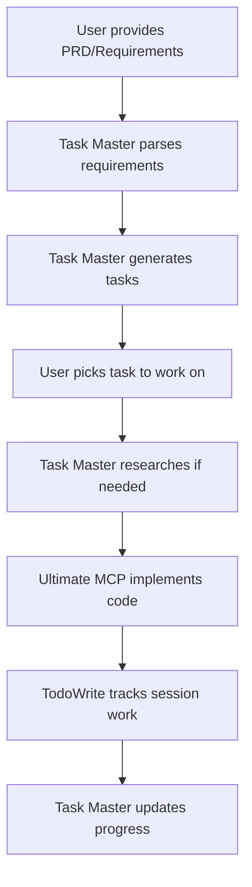

# Claude Task Master Integration Summary

## What We Did

1. **Added Task Master to Claude Code:**
   ```bash
   claude mcp add task-master "npx task-master-mcp" --scope user
   ```

2. **Created Integration Documentation:**
   - `CLAUDE_TASK_MASTER_INTEGRATION.md` - Detailed integration guide
   - `CLAUDE.md` - Instructions for Claude Code on when to use Task Master
   - `.taskmaster` - Configuration file for Task Master

3. **Established Task Management Strategy:**
   - **Task Master**: Project-level planning, PRD parsing, research
   - **TodoWrite/Read**: Session-level tracking, quick tasks
   - **Ultimate MCP**: Code generation, error analysis, implementation

## How Task Master Enhances Claude Code

### 1. **Structured Project Planning**
- Parse PRDs and requirements documents
- Generate comprehensive task lists
- Track dependencies and progress

### 2. **Research Capabilities**
- Context-aware technology research
- Implementation strategy discovery
- Best practices gathering

### 3. **Persistent Task Management**
- Tasks persist across Claude sessions
- Project-level organization
- Progress tracking

## Workflow Integration



## Key Benefits

1. **Better Organization**: Structured task management for complex projects
2. **Research First**: Gather context before implementation
3. **Multi-Model Support**: Use best model for each task
4. **Persistence**: Tasks survive Claude restarts
5. **Integration**: Works seamlessly with existing tools

## Next Steps

1. **Restart Claude** to load Task Master MCP server
2. **Test with a sample PRD** to verify integration
3. **Use the hybrid approach** for task management

## Example Usage

```bash
# After restart, these commands will work:
"Parse this PRD: [PRD content]"
"What tasks were generated?"
"Research authentication best practices for task 3"
"Help me implement the login endpoint"
"Mark task 3 as complete"
```

Task Master is now integrated and ready to enhance Claude Code's project management capabilities!