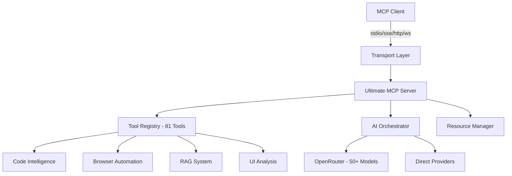

# Ultimate MCP Server

<div align="center">
  
  
  
  
  
  
  
  
  <h1>🚀 The Ultimate AI Coding Assistant</h1>
  <p><strong>81 Powerful Tools | 50+ AI Models | Universal Platform Support</strong></p>
  
  <p>The definitive all-in-one Model Context Protocol (MCP) server that supercharges your AI coding experience across every major platform.</p>

</div>

---

## 🎯 Quick Installation

<div align="center">
  <table>
    <tr>
      <td align="center" width="200">
        <h3>Claude Desktop</h3>
        <a href="#claude-desktop">
          
        </a>
        <br><br>
        <code>npx @claude/create-mcp-server</code>
      </td>
      <td align="center" width="200">
        <h3>Claude Code</h3>
        <a href="#claude-code">
          
        </a>
        <br><br>
        <code>claude mcp add ultimate</code>
      </td>
      <td align="center" width="200">
        <h3>Cursor</h3>
        <a href="#cursor">
          
        </a>
        <br><br>
        <a href="#cursor">📋 Config Guide</a>
      </td>
      <td align="center" width="200">
        <h3>VS Code</h3>
        <a href="#vs-code">
          
        </a>
        <br><br>
        <a href="#vs-code">🔌 Continue Extension</a>
      </td>
    </tr>
  </table>
</div>

---

## ✨ Features

<table>
<tr>
<td width="50%">

### 🤖 AI Models (50+)
- **OpenAI**: GPT-4o, GPT-4o-mini, o1-preview
- **Anthropic**: Claude 3 Opus, Sonnet, Haiku
- **Google**: Gemini 2.5 Pro/Flash
- **xAI**: Grok-2, Grok-3, Grok-4 (Beta)
- **DeepSeek**: V3, R1, Coder V2
- **Meta**: Llama 3.3 70B/405B
- **Mistral**: Large 2411, Codestral
- And many more...

</td>
<td width="50%">

### 🛠️ Tool Categories (81 Tools)
- **Code Analysis**: Error debugging, optimization
- **Code Generation**: Multi-language support
- **Large Codebase**: 1M+ token analysis
- **RAG System**: Vector search, embeddings
- **Browser Automation**: Web scraping, testing
- **UI/UX Analysis**: Design system extraction
- **Cognitive Memory**: Knowledge graphs
- **Content Management**: Documentation

</td>
</tr>
</table>

---

## 📦 Installation Guides

### Claude Desktop

<details>
<summary><b>🖥️ Click to expand Claude Desktop setup</b></summary>

#### Method 1: Using Claude's Official Tool
```bash
npx @claude/create-mcp-server
# Select "ultimate-mcp-server" from the list
```

#### Method 2: Manual Configuration
1. Open Claude Desktop settings
2. Navigate to Developer → Model Context Protocol
3. Click "Add Server" and enter:
   - Name: `ultimate`
   - Command: `npx`
   - Arguments: `ultimate-mcp-server`

#### Method 3: Edit Configuration File
Add to `~/Library/Application Support/Claude/claude_desktop_config.json`:
```json
{
  "mcpServers": {
    "ultimate": {
      "command": "npx",
      "args": ["ultimate-mcp-server"],
      "env": {
        "OPENROUTER_API_KEY": "your-key-here"
      }
    }
  }
}
```
</details>

### Claude Code

<details>
<summary><b>💻 Click to expand Claude Code setup</b></summary>

#### Quick Install (Recommended)
```bash
claude mcp add ultimate npx ultimate-mcp-server
```

#### With API Keys
```bash
claude mcp add ultimate npx ultimate-mcp-server \
  -e OPENROUTER_API_KEY=your-key \
  -e ANTHROPIC_API_KEY=your-key \
  -e GOOGLE_API_KEY=your-key
```

#### Local Development
```bash
# Clone and build
git clone https://github.com/RaiAnsar/ultimate-mcp-server.git
cd ultimate-mcp-server
npm install && npm run build

# Add local version
claude mcp add ultimate node ./dist/index.js
```

#### Verify Installation
```bash
claude mcp list
# Should show: ultimate: npx ultimate-mcp-server - ✓ Connected
```
</details>

### Cursor

<details>
<summary><b>⚡ Click to expand Cursor setup</b></summary>

1. Open Cursor Settings (`Cmd/Ctrl + ,`)
2. Search for "MCP" or navigate to Features → MCP
3. Click "Add MCP Server"
4. Configure:

```json
{
  "name": "ultimate",
  "command": "npx",
  "args": ["ultimate-mcp-server"],
  "env": {
    "OPENROUTER_API_KEY": "your-key-here"
  }
}
```

5. Restart Cursor to activate

**Alternative: Direct Config Edit**

Edit `~/.cursor/config/settings.json`:
```json
{
  "mcp": {
    "servers": {
      "ultimate": {
        "command": "npx",
        "args": ["ultimate-mcp-server"],
        "env": {
          "OPENROUTER_API_KEY": "your-key"
        }
      }
    }
  }
}
```
</details>

### VS Code (Continue Extension)

<details>
<summary><b>📝 Click to expand VS Code setup</b></summary>

1. Install Continue extension from VS Code marketplace
2. Open Continue settings (`Cmd/Ctrl + Shift + P` → "Continue: Open Settings")
3. Add MCP configuration:

```json
{
  "models": [...],
  "mcpServers": {
    "ultimate": {
      "command": "npx",
      "args": ["ultimate-mcp-server"],
      "env": {
        "OPENROUTER_API_KEY": "your-key"
      }
    }
  }
}
```

4. Reload VS Code window
</details>

### Windsurf

<details>
<summary><b>🏄 Click to expand Windsurf setup</b></summary>

1. Open Windsurf Settings
2. Navigate to AI → MCP Servers
3. Click "Add Server"
4. Enter configuration:

```yaml
name: ultimate
command: npx
args:
  - ultimate-mcp-server
env:
  OPENROUTER_API_KEY: your-key
```

5. Save and restart Windsurf
</details>

### Cline

<details>
<summary><b>🔧 Click to expand Cline setup</b></summary>

Add to `~/.cline/config.json`:
```json
{
  "mcpServers": {
    "ultimate": {
      "command": "npx",
      "args": ["ultimate-mcp-server"],
      "env": {
        "OPENROUTER_API_KEY": "your-key"
      }
    }
  }
}
```
</details>

### Google AI Studio

<details>
<summary><b>🎨 Click to expand Google AI Studio setup</b></summary>

1. Open Google AI Studio
2. Go to Settings → Extensions
3. Enable MCP Support
4. Add server configuration:

```json
{
  "ultimate": {
    "command": "npx",
    "args": ["ultimate-mcp-server"],
    "transport": "stdio"
  }
}
```
</details>

---

## 🔑 API Configuration

<details>
<summary><b>Click to see all supported API providers</b></summary>

### Required API Keys (at least one)

| Provider | Environment Variable | Get API Key | Models |
|----------|---------------------|-------------|---------|
| OpenRouter | `OPENROUTER_API_KEY` | [Get Key](https://openrouter.ai/keys) | All 50+ models |
| Anthropic | `ANTHROPIC_API_KEY` | [Get Key](https://console.anthropic.com/) | Claude models |
| OpenAI | `OPENAI_API_KEY` | [Get Key](https://platform.openai.com/api-keys) | GPT models |
| Google | `GOOGLE_API_KEY` | [Get Key](https://aistudio.google.com/apikey) | Gemini models |
| Perplexity | `PERPLEXITY_API_KEY` | [Get Key](https://www.perplexity.ai/settings/api) | Online search |

### Setting API Keys

#### Method 1: Environment Variables
```bash
export OPENROUTER_API_KEY="sk-or-..."
export ANTHROPIC_API_KEY="sk-ant-..."
```

#### Method 2: .env File
Create `.env` in your project:
```env
OPENROUTER_API_KEY=sk-or-...
ANTHROPIC_API_KEY=sk-ant-...
GOOGLE_API_KEY=...
```

#### Method 3: MCP Configuration
Add to your MCP client config:
```json
{
  "env": {
    "OPENROUTER_API_KEY": "your-key",
    "ANTHROPIC_API_KEY": "your-key"
  }
}
```
</details>

---

## 🚀 Usage Examples

### Basic Commands

```bash
# Start server (stdio mode)
npx ultimate-mcp-server

# With specific transport
ENABLE_SSE=true npx ultimate-mcp-server

# With multiple transports
ENABLE_HTTP=true ENABLE_WEBSOCKET=true npx ultimate-mcp-server
```

### Tool Examples

<details>
<summary><b>View code examples</b></summary>

#### Ask AI
```typescript
// In your MCP client
await callTool('ask', {
  prompt: 'Explain async/await in JavaScript',
  model: 'openai/gpt-4o'
});
```

#### Analyze Error
```typescript
await callTool('analyze_error', {
  error: 'TypeError: Cannot read property "x" of undefined',
  language: 'javascript'
});
```

#### Generate Code
```typescript
await callTool('generate_code', {
  description: 'Binary search algorithm',
  language: 'python',
  includeTests: true
});
```

#### Analyze Large Codebase
```typescript
await callTool('analyze_large_codebase', {
  rootDir: './src',
  query: 'Find all API endpoints',
  pattern: '.*\\.(ts|js)$'
});
```
</details>

---

## 📊 Tool Categories

<details>
<summary><b>🤖 AI & Orchestration (10 tools)</b></summary>

- `ask` - Query specific AI models
- `orchestrate` - Multi-model orchestration
- `generate_code` - AI code generation
- `explain_code` - Code explanation
- `suggest_optimizations` - Performance optimization
- `debugging_session` - Interactive debugging
- `analyze_error` - Error analysis
- `analyze_codebase` - Codebase analysis
- `find_in_codebase` - Pattern search
- `get_metrics` - Performance metrics
</details>

<details>
<summary><b>📚 Large Context Analysis (7 tools)</b></summary>

- `analyze_large_codebase` - Analyze with 1M+ tokens
- `generate_directory_tree` - Visual directory structure
- `collect_code_context` - Context collection
- `analyze_project_structure` - Architecture analysis
- `find_codebase_patterns` - Pattern detection
- `generate_project_docs` - Auto documentation
- `estimate_analysis_cost` - Cost estimation
</details>

<details>
<summary><b>🧠 RAG & Memory (8 tools)</b></summary>

- `rag_ingest_document` - Document ingestion
- `rag_search` - Semantic search
- `rag_query` - Q&A with sources
- `build_knowledge_graph` - Graph construction
- `cognitive_search` - Memory search
- `build_memory_context` - Context building
- `get_related_memories` - Related concepts
- `export_knowledge_graph` - Graph export
</details>

<details>
<summary><b>🌐 Browser & UI (10 tools)</b></summary>

- `analyze_ui_design` - UI/UX analysis
- `extract_design_system` - Design tokens
- `check_ui_accessibility` - WCAG compliance
- `compare_ui_designs` - A/B comparison
- `suggest_ui_improvements` - UX suggestions
- `analyze_ui_components` - Component audit
- `create_ui_style_guide` - Style documentation
- `analyze_user_flow` - Journey mapping
- `browser_navigate` - Web navigation
- `browser_screenshot` - Page capture
</details>

<details>
<summary><b>🔍 Search & Navigation (5 tools)</b></summary>

- `universal_search` - Multi-provider search
- `search_files` - File search
- `search_content` - Content grep
- `search_processes` - Process search
- `search_everything` - Unified search
</details>

---

## 🏗️ Architecture



---

## 🔧 Development

```bash
# Clone repository
git clone https://github.com/RaiAnsar/ultimate-mcp-server.git
cd ultimate-mcp-server

# Install dependencies
npm install

# Build project
npm run build

# Run tests
npm test

# Development mode
npm run dev
```

### Project Structure
```
ultimate-mcp-server/
├── src/
│   ├── core/           # Core MCP functionality
│   ├── tools/          # All 81 tools
│   ├── providers/      # AI providers
│   ├── transports/     # Transport layers
│   └── utils/          # Utilities
├── dist/               # Compiled output
└── package.json
```

---

## 🤝 Contributing

Contributions are welcome! Please read our [Contributing Guide](CONTRIBUTING.md) for details.

1. Fork the repository
2. Create your feature branch (`git checkout -b feature/AmazingFeature`)
3. Commit your changes (`git commit -m 'Add some AmazingFeature'`)
4. Push to the branch (`git push origin feature/AmazingFeature`)
5. Open a Pull Request

---

## 📝 License

This project is licensed under the MIT License - see the [LICENSE](LICENSE) file for details.

---

## 🆘 Support

- **Documentation**: [Full Docs](https://github.com/RaiAnsar/ultimate-mcp-server/wiki)
- **Issues**: [Report Bug](https://github.com/RaiAnsar/ultimate-mcp-server/issues)
- **Discussions**: [Community Forum](https://github.com/RaiAnsar/ultimate-mcp-server/discussions)
- **Discord**: [Join Server](https://discord.gg/ultimate-mcp)

---

## ⭐ Star History

[](https://star-history.com/#RaiAnsar/ultimate-mcp-server&Date)

---

<div align="center">
  <p>Built with ❤️ by <a href="https://github.com/RaiAnsar">Rai Ansar</a> and contributors</p>
  <p>
    <a href="https://github.com/RaiAnsar/ultimate-mcp-server">⭐ Star us on GitHub</a> • 
    <a href="https://twitter.com/intent/tweet?text=Check%20out%20Ultimate%20MCP%20Server%20-%2081%20tools%20for%20AI%20coding!&url=https://github.com/RaiAnsar/ultimate-mcp-server">Share on Twitter</a>
  </p>
</div>